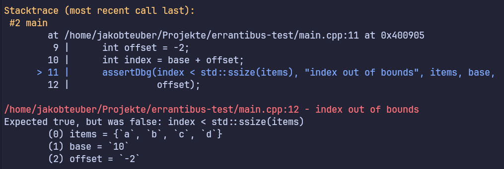

*Errantibus* — For those who make errors
========================================

*Errantibus* is an assertion library for C++, with better 
error messages than a plain `assert`.

# Usage 

```cpp  
#include <errantibus.hpp>

#include <array>

int main() {
  auto items = std::array{"a", "b", "c", "d"};
  int base = 10;
  int offset = -2;
  int index = base + offset; // Simulate some non-trivial index calculation

  assertDbg(index < std::ssize(items), "index out of bounds", items, base,
            offset);
}```

In a build with debug assertions enabled and debug information (`-g`), this will
produce something close this output:



```
Stacktrace (most recent call last):
 #2 main
        at /home/jakobteuber/Projekte/errantibus-test/main.cpp:11 at 0x400905
         9 |      int offset = -2;
        10 |      int index = base + offset;
      > 11 |      assertDbg(index < std::ssize(items), "index out of bounds", items, base,
        12 |                offset);

/home/jakobteuber/Projekte/errantibus-test/main.cpp:12 - index out of bounds
Expected true, but was false: index < std::ssize(items)
        (0) items = {`a`, `b`, `c`, `d`}
        (1) base = `10`
        (2) offset = `-2`
```

```
```

The following macros are provided:

| Debug | Always |
| ----- | ------ | 
| `assertDbg(condition, message, ...)` | `assertAlways(condition, message, ...)` |
| `assertDbgEq(a, b, message, ...)` | `assertAlwaysEq(a, b, message, ...)` |
| `assertDbgNeq(a, b, message, ...)` | `assertAlwaysNeq(a, b, message, ...)` |
| `failDbg(message, ...)` | `failAlways(message, ...)` | 
| `debug(...)` | — |

For Debug builds, *Errantibus* will try to provide as much information 
as possible: It displays a stacktrace (via Boost Stacktrace) and attempts
to output all the additional information provided to the macro. For the best 
results, enable debug options with `-g`.

If you want to build for release, you can define `ERRANTIBUS_NODEBUG`. If it is
defined, the debug versions won't create asserts. Instead, it will inform the 
compiler that the asserted condition will always hold, so it can optimized based 
on, e.g. the unreachability of a `failDbg`. The assertions that are always active
will still be active, if they fail the program will be terminated with a minimal
notice.

# Setup

With CMake, you can use Errantibus via FetchContent:

```cmake
cmake_minimum_required(VERSION 3.30)
project(DemoApp LANGUAGES CXX)

set(CMAKE_CXX_STANDARD 23)
set(CMAKE_CXX_STANDARD_REQUIRED ON)
set(CMAKE_CXX_FLAGS "-g")

include(FetchContent)

# Fetch the Errantibus library
FetchContent_Declare(
    Errantibus
    GIT_REPOSITORY https://github.com/jakobteuber/Errantibus.git
    GIT_TAG v0.0.1
)
FetchContent_MakeAvailable(Errantibus)

# Build your application
add_executable(DemoApp main.cpp)
target_link_libraries(DemoApp PRIVATE Errantibus)```


# License

Copyright 2025 Jakob Teuber

Licensed under the Apache License, Version 2.0 (the "License");
you may not use this file except in compliance with the License.
You may obtain a copy of the License at

    http://www.apache.org/licenses/LICENSE-2.0

Unless required by applicable law or agreed to in writing, software
distributed under the License is distributed on an "AS IS" BASIS,
WITHOUT WARRANTIES OR CONDITIONS OF ANY KIND, either express or implied.
See the License for the specific language governing permissions and
limitations under the License.
